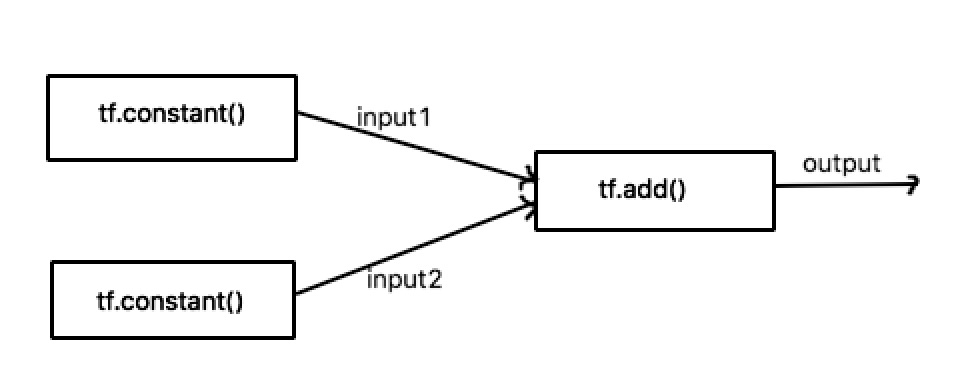

## 关于Tensorflow的基本介绍 ##

[Tensorflow](https://www.tensorflow.org/)是一个基于图的计算系统，其主要应用于机器学习。

从Tensorflow名字的字面意思可以拆分成两部分来理解：Tensor+flow。
- Tensor：中文名可以称为“张量”，其本质就是任意维度的数组。一个向量就是一个1维的Tensor，一个矩阵就是2维的Tensor。
- Flow：指的就是图计算中的数据流。

当我们想要使用Tensorflow做什么事情的时候，一般需要三个操作步骤：

1. 创建Tensor；
2. 添加Operations（Operations输入Tensor，然后输出另一个Tensor）；
3. 执行计算（也就是运行一个可计算的图）。

Tensorflow有个图的概念，Operations会添加到图中，作为图的节点。在添加某Operation的时候，不会立即执行该Operation。Tensorflow会等待所有Operation添加完毕，然后Tensorflow会优化该计算图，以便决定如何执行计算。

## 向量相加 ##
下面我们通过两个向量相加的简单例子来看一下Tensorflow的基本用法。
```
[1. 1. 1. 1.] + [2. 2. 2. 2.] = [3. 3. 3. 3.]
```

```python
import tensorflow as tf
with tf.Session():
  input1 = tf.constant([1.0 1.0 1.0 1.0])
  input2 = tf.constant([2.0 2.0 2.0 2.0])
  output = tf.add(input1, input2)
  result = output.eval()
  print result
```

Tensorflow的计算必须要在一个Session的上下文中。Session会包含一个计算图，而这个图你添加的Tensors和Operations。当然，你在添加Tensor和Operation的时候，它们都不会立即进行计算，而是等到最后需要计算Session的结果的时候。当Tensorflow之后了计算图中的所有Tensor和Operation之后，其会知道如何去优化和执行图的计算。

两个tf.constant() 语句向计算图中创建了两个Tensor。调用tf.constant()的动作大致可以说为，创建两个指定维度的Tensor，以及两个constant操作符用于初始化相对应的Tensor（不会立即执行）。

tf.add()语句向计算图中添加了一个add操作，当不会立即执行，这时候add操作的结果还无法获取。此时，计算图大致如下所示，


> result = output.eval()
> print result

当我们最后调用output.eval()时，会触发Tensorflow执行计算图，从而获取output计算结点的结果。

## Variable的使用 ##
我们上面的例子使用的Tensor是常量（constant），而在我们实际的机器学习任务中，我们往往需要变量（variable）来记录一下可变的状态（例如神经网络节点的权重参数等）。下面我们来看一个简单的variable例子。

```python
import tensorflow as tf
import numpy as np

with tf.Session() as sess:
  # Set up two variables, total and weights, that we'll change repeatedly.
  total = tf.Variable(tf.zeros([1, 2]))
  weights = tf.Variable(tf.random_uniform([1,2]))
  
  # Initialize the variables we defined above.
  tf.initialize_all_variables().run()
  
  # This only adds the operators to the graph right now. The assignment
  # and addition operations are not performed yet.
  update_weights = tf.assign(weights, tf.random_uniform([1, 2], -1.0, 1.0))
  update_total = tf.assign(total, tf.add(total, weights))
  
  for _ in range(5):
    # Actually run the operation graph, so randomly generate weights and then
    # add them into the total. Order does matter here. We need to update
    # the weights before updating the total.
    sess.run(update_weights)
    sess.run(update_total)
    
    print weights.eval(), total.eval()
```

概括了说，上面的代码就是创建了两个变量total和weights（都是1维的tensor），total所有元素初始化为0，而weights的元素则用-1到1之间的随机数进行初始化。然后在某个迭代中，使用-1到1之间的随机数来更新变量weights的元素，然后添加到变量total中。

在调用tf.Variable()的时候，只是定了变量以及变量的初始化操作（实际上并未执行）。所有变量都需要在开始执行图计算之前进行初始化。调用tf.initialize\_all\_variables().run()来对所有变量进行初始化。

在for循环中，
> sess.run(update_weights)

触发执行更新weights变量的计算。

> sess.run(update_total)

则处理了将变量total和变量weights进行相加，并将结果赋值到变量total。


