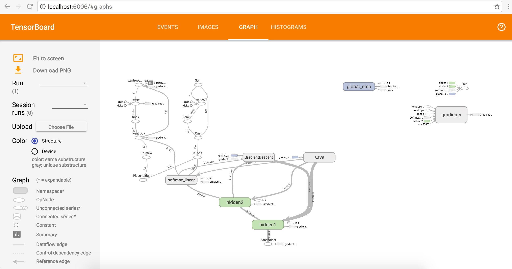
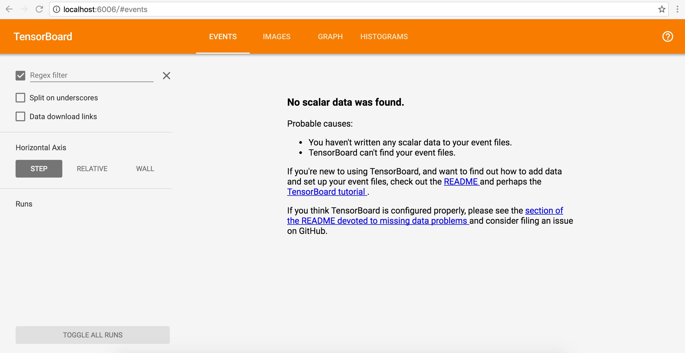
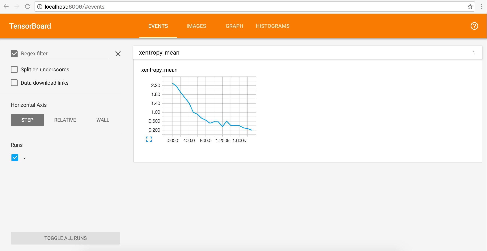
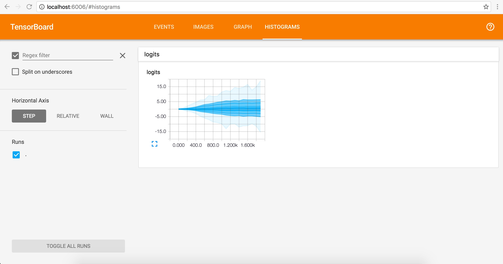

# TensorBoard简介 #
Tensorflow发布包中提供了TensorBoard，用于展示Tensorflow任务在计算过程中的Graph、定量指标图以及附加数据。大致的效果如下所示，


# TensorBoard工作机制 #
TensorBoard 通过读取 TensorFlow 的事件文件来运行。TensorFlow 的事件文件包括了你会在 TensorFlow 运行中涉及到的主要数据。关于TensorBoard的详细介绍请参考[TensorBoard:可视化学习](http://www.tensorfly.cn/tfdoc/how_tos/summaries_and_tensorboard.html)。下面做个简单介绍。

Tensorflow的API中提供了一种叫做[Summary](http://www.tensorfly.cn/tfdoc/api_docs/python/train.html#AUTOGENERATED-summary-operations)的操作，用于将Tensorflow计算过程的相关数据序列化成字符串Tensor。例如标量数据的图表[scalar_summary](http://www.tensorfly.cn/tfdoc/api_docs/python/train.html#scalar_summary)或者梯度权重的分布[histogram_summary](http://www.tensorfly.cn/tfdoc/api_docs/python/train.html#histogram_summary)。

通过[tf.train.SummaryWriter](http://www.tensorfly.cn/tfdoc/api_docs/python/train.html#SummaryWriter)来将序列化后的Summary数据保存到磁盘指定目录（通过参数logdir指定）。此外，SummaryWriter构造函数还包含了一个可选参数GraphDef，通过指定该参数，可以在TensorBoard中展示Tensorflow中的Graph（如上图所示）。

大致的代码框架如下所示：
```python
merged_summary_op = tf.merge_all_summaries()
summary_writer = tf.train.SummaryWriter('/tmp/mnist_logs', sess.graph)
total_step = 0
while training:
  total_step += 1
  session.run(training_op)
  if total_step % 100 == 0:
    summary_str = session.run(merged_summary_op)
    summary_writer.add_summary(summary_str, total_step)
```

启动TensorBoard的命令如下，
```shell
python tensorflow/tensorboard/tensorboard.py --logdir=/tmp/mnist_logs
```

其中--logdir命令行参数指定的路径必须跟SummaryWriter的logdir参数值保持一致，TensorBoard才能够正确读取到Tensorflow的事件文件。

启动Tensorflow后，我们在浏览器中输入http://localhost:6006 即可访问TensorBoard页面了。

# 通过MNIST实例来验证TensorBoard #
[tensorflow/tensorflow](https://github.com/tensorflow/tensorflow)的源代码目录tensorflow/examples/tutorials/mnist目录下提供了手写数字MNIST识别样例代码。该样例代码同样包含了SummaryWriter的相关代码，我们可以使用该样例代码来验证一下TensorBoard的效果。

首先，克隆一下tensorflow的代码库到本地，
```shell
$ git clone https://github.com/tensorflow/tensorflow.git
$ cd tensorflow/examples/tutorials/mnist/
$ emacs fully_connected_feed.py
```

对fully\_connected\_feed.py的代码做一下下面两个地方的修改：

1. 将29、30行的import语句修改一下
  ```python
  import input_data
  import mnist
  ```
  
2. 将154行的FLAGS.train\_dir修改成'/opt/tensor'：
  ```python
  # Instantiate a SummaryWriter to output summaries and the Graph.
  summary_writer = tf.train.SummaryWriter('/opt/tensor', sess.graph)
  ```

样例代码准备好了，下面我们如何启动TensorBoard。

Tensorflow官方的Docker镜像[tensorflow/tensorflow](https://hub.docker.com/r/tensorflow/tensorflow/)提供了一个可快速使用Tensorflow的途径。不过该镜像默认启动的是jupyter。我们通过下面命令通过该镜像启动TensorBoard，并且将我们准备好的MNIST样例代码通过volume挂载到容器中。
```shell
lienhuadeMacBook-Pro:tensorflow lienhua34$ docker run -d -p 6006:6006 --name=tensorboard -v /Users/lienhua34/Programs/python/tensorflow/tensorflow/examples/tutorials/mnist:/tensorflow/mnist tensorflow/tensorflow tensorboard --logdir=/opt/tensor
50eeb7282f60c10ed52d26f34feeb3472cf36d83c546357801c45e14939adf1a
lienhuadeMacBook-Pro:tensorflow lienhua34$ 
lienhuadeMacBook-Pro:tensorflow lienhua34$ docker ps -a
CONTAINER ID        IMAGE                                    COMMAND                  CREATED             STATUS                   PORTS                              NAMES
50eeb7282f60        tensorflow/tensorflow                    "tensorboard --logdir"   49 minutes ago      Up 4 seconds             0.0.0.0:6006->6006/tcp, 8888/tcp   tensorboard
```

此时，我们在浏览器中输入http://localhost:6006/ ,得到下面的效果，


因为我们还没有运行MNIST的样例代码，所以TensorBoard提示没有数据。下面我们将进入tensorboard容器中运行MNIST的样例代码，
```shell
lienhuadeMacBook-Pro:tensorflow lienhua34$ docker exec -ti tensorboard /bin/bash
root@50eeb7282f60:/notebooks# cd /tensorflow/mnist/                                                                                                                                 
root@50eeb7282f60:/tensorflow/mnist# python fully_connected_feed.py 
Extracting data/train-images-idx3-ubyte.gz
Extracting data/train-labels-idx1-ubyte.gz
Extracting data/t10k-images-idx3-ubyte.gz
Extracting data/t10k-labels-idx1-ubyte.gz
Step 0: loss = 2.31 (0.010 sec)
Step 100: loss = 2.13 (0.007 sec)
Step 200: loss = 1.90 (0.008 sec)
Step 300: loss = 1.56 (0.008 sec)
Step 400: loss = 1.37 (0.007 sec)
Step 500: loss = 0.99 (0.005 sec)
Step 600: loss = 0.82 (0.004 sec)
Step 700: loss = 0.77 (0.004 sec)
Step 800: loss = 0.83 (0.004 sec)
Step 900: loss = 0.54 (0.004 sec)
Training Data Eval:
  Num examples: 55000  Num correct: 47055  Precision @ 1: 0.8555
Validation Data Eval:
  Num examples: 5000  Num correct: 4303  Precision @ 1: 0.8606
Test Data Eval:
  Num examples: 10000  Num correct: 8639  Precision @ 1: 0.8639
Step 1000: loss = 0.52 (0.010 sec)
Step 1100: loss = 0.58 (0.444 sec)
Step 1200: loss = 0.44 (0.005 sec)
Step 1300: loss = 0.42 (0.005 sec)
Step 1400: loss = 0.69 (0.005 sec)
Step 1500: loss = 0.43 (0.004 sec)
Step 1600: loss = 0.43 (0.006 sec)
Step 1700: loss = 0.39 (0.004 sec)
Step 1800: loss = 0.34 (0.004 sec)
Step 1900: loss = 0.34 (0.004 sec)
Training Data Eval:
  Num examples: 55000  Num correct: 49240  Precision @ 1: 0.8953
Validation Data Eval:
  Num examples: 5000  Num correct: 4506  Precision @ 1: 0.9012
Test Data Eval:
  Num examples: 10000  Num correct: 8987  Precision @ 1: 0.8987
root@50eeb7282f60:/tensorflow/mnist# ls -l /opt/tensor
total 76
-rw-r--r-- 1 root root 77059 Oct 25 14:53 events.out.tfevents.1477407177.50eeb7282f60
```

通过上面的运行结果，我们看到MNIST样例代码正常运行，而且在/opt/tensor目录下也生成了Tensorflow的事件文件events.out.tfevents.1477407177.50eeb7282f60。此时我们刷新一下TensorBoard的页面，看到的效果如下，




(done)

